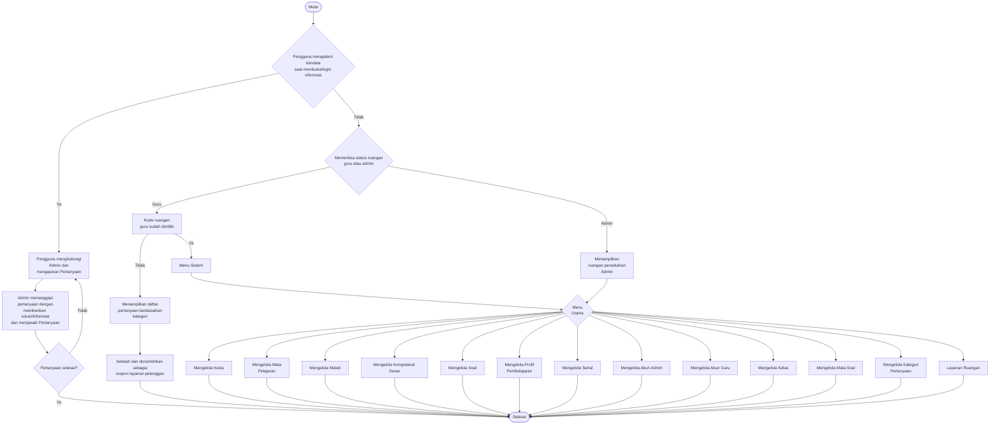
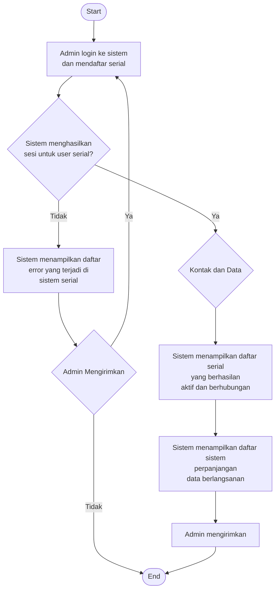
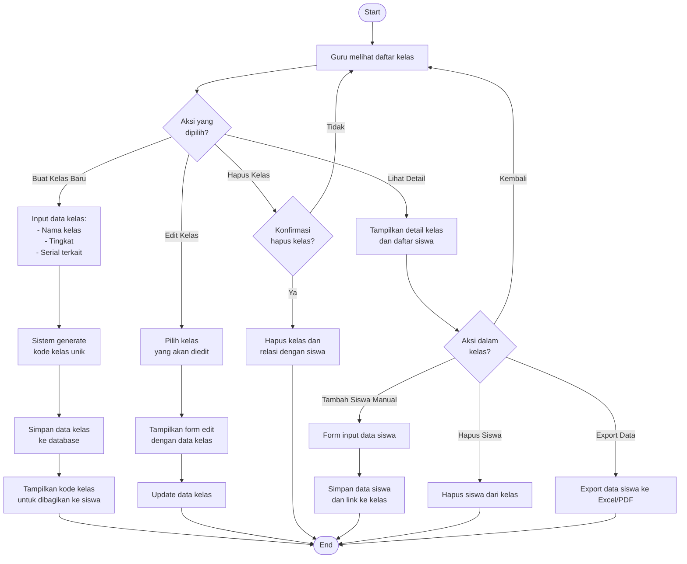
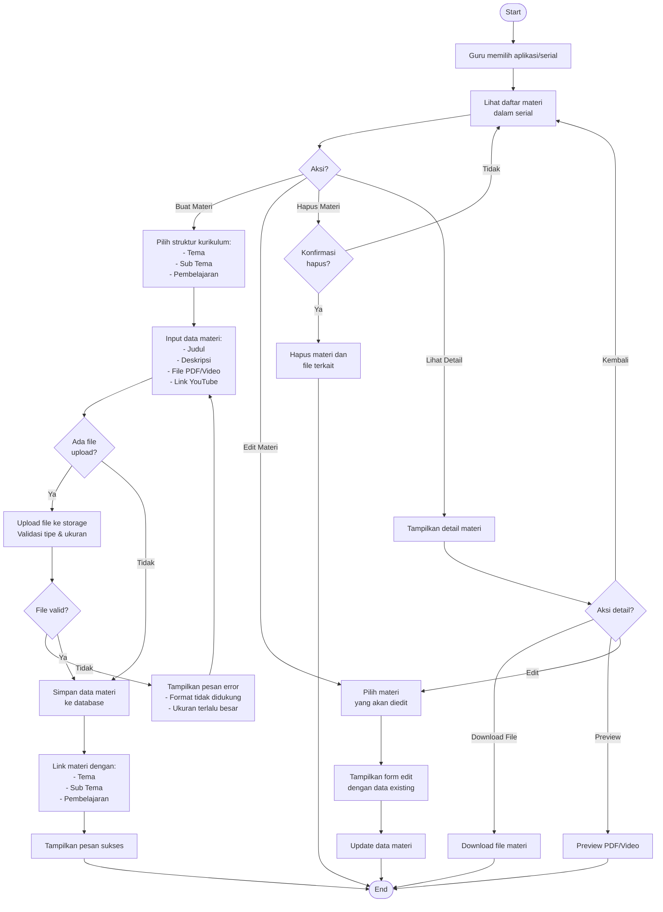
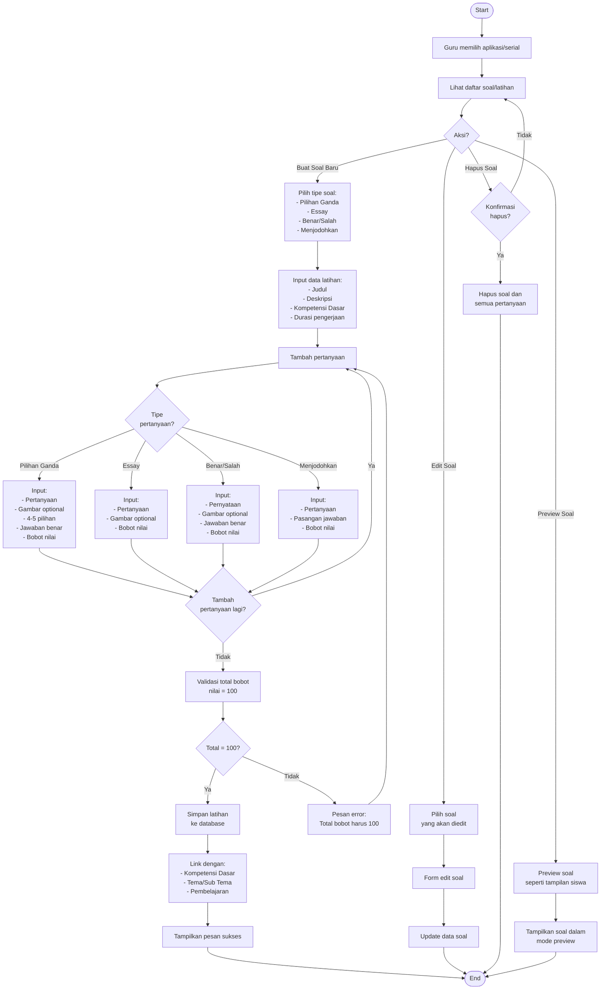
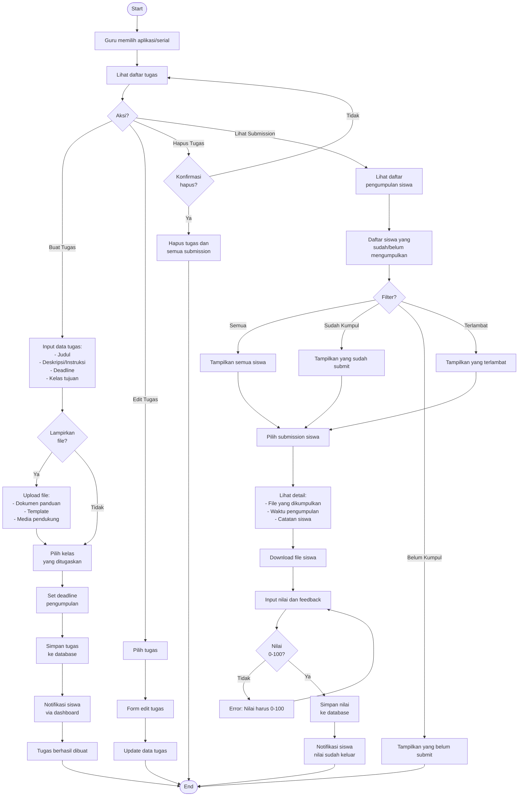
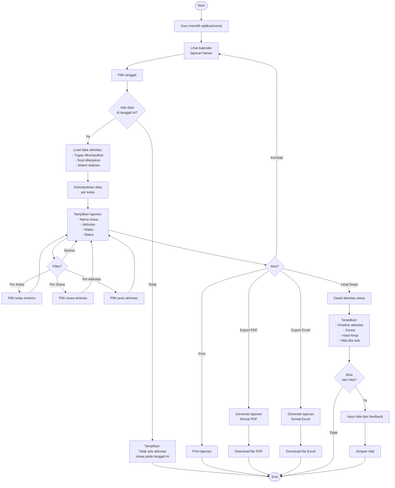
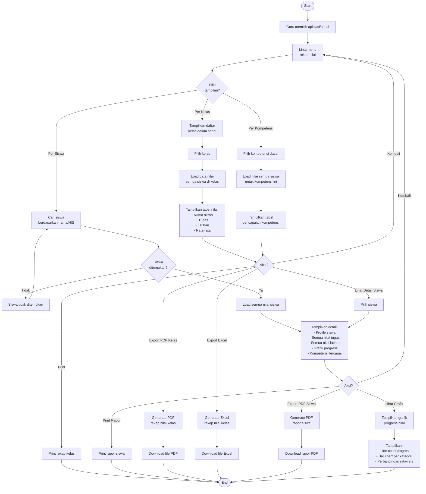

# PERANCANGAN SISTEM

# Sistem DashboardGuru

---

## Daftar Isi

1. [Flowchart Sistem Utama](#1-flowchart-sistem-utama)
2. [Alur Login dan Autentikasi](#2-alur-login-dan-autentikasi)
3. [Alur Manajemen Kelas](#3-alur-manajemen-kelas)
4. [Alur Materi Pembelajaran](#4-alur-materi-pembelajaran)
5. [Alur Soal dan Latihan](#5-alur-soal-dan-latihan)
6. [Alur Tugas dan Penilaian](#6-alur-tugas-dan-penilaian)
7. [Alur Laporan Harian](#7-alur-laporan-harian)
8. [Alur Rekap Nilai](#8-alur-rekap-nilai)
9. [Alur Kelas Online (Jitsi Meet)](#9-alur-kelas-online-jitsi-meet)

---

## Format Diagram

Semua flowchart dalam dokumen ini tersedia dalam 2 format:

- **Mermaid** (embedded di dokumen ini)
- **PlantUML** (file terpisah di folder [plantuml/](plantuml/))

Untuk melihat diagram PlantUML, buka file `.puml` di folder `plantuml/` menggunakan:

- PlantUML Online Editor: http://www.plantuml.com/plantuml/uml/
- VS Code dengan extension PlantUML
- Lihat [panduan lengkap](plantuml/README.md)

---

## 1. Flowchart Sistem Utama

> 📄 **PlantUML File:** [plantuml/01-sistem-utama.puml](plantuml/01-sistem-utama.puml)

### 1.1. Alur Umum Sistem



### 1.2. Penjelasan Alur Sistem Utama

**Proses Awal:**

1. Pengguna mengakses sistem
2. Sistem memeriksa kendala/masalah saat login
3. Jika ada kendala → hubungi Admin untuk bantuan
4. Jika tidak ada kendala → lanjut ke proses autentikasi

**Pengecekan Role:**

- **Admin**: Diarahkan ke dashboard admin dengan akses penuh
- **Guru**: Memeriksa kepemilikan kode ruangan/kelas

**Menu Sistem (Guru/Admin):**
Sistem menyediakan berbagai menu pengelolaan:

- Mengelola Kelas
- Mengelola Mata Pelajaran
- Mengelola Materi
- Mengelola Kompetensi Dasar
- Mengelola Soal
- Mengelola Profil Pembelajaran
- Mengelola Serial
- Mengelola Akun
- Mengelola Kategori
- Kelas Online
- Laporan

---

## 2. Alur Login dan Autentikasi

> 📄 **PlantUML File:** [plantuml/02-login-autentikasi.puml](plantuml/02-login-autentikasi.puml)



### 2.1. Penjelasan Proses Login

**Tahapan Login:**

1. **Input Kredensial**

   - User memasukkan username/email dan password
   - Sistem menerima data login

2. **Validasi Data**

   - Sistem memeriksa kecocokan kredensial dengan database
   - Jika tidak valid → tampilkan pesan error
   - Jika valid → lanjut pengecekan serial

3. **Pengecekan Serial**

   - Sistem memeriksa apakah user memiliki serial aktif
   - Memeriksa masa berlaku serial (expired date)
   - Jika serial tidak valid/expired → tolak akses
   - Jika serial valid → buat session

4. **Pembuatan Session**

   - Sistem menyimpan informasi user dalam session
   - Menyimpan informasi serial aktif
   - Mencatat waktu login

5. **Redirect ke Dashboard**
   - User diarahkan ke halaman sesuai role
   - Admin → admin dashboard
   - Guru → pilih aplikasi/dashboard

---

## 3. Alur Manajemen Kelas

> 📄 **PlantUML File:** [plantuml/03-manajemen-kelas.puml](plantuml/03-manajemen-kelas.puml)



### 3.1. Penjelasan Manajemen Kelas

**Fitur Utama:**

1. **Membuat Kelas Baru**

   - Input: Nama kelas, tingkat, serial yang digunakan
   - Sistem auto-generate kode kelas unik (6-8 karakter)
   - Kode ini dibagikan ke siswa untuk bergabung

2. **Edit Kelas**

   - Mengubah nama kelas atau informasi lainnya
   - Kode kelas tetap sama (tidak berubah)

3. **Hapus Kelas**

   - Memerlukan konfirmasi
   - Menghapus relasi dengan siswa (siswa bisa pindah ke kelas lain)

4. **Detail Kelas**
   - Melihat daftar siswa dalam kelas
   - Menambah/menghapus siswa secara manual
   - Export data siswa

**Validasi:**

- Nama kelas tidak boleh kosong
- Satu serial bisa memiliki banyak kelas
- Kode kelas harus unik dalam sistem

---

## 4. Alur Materi Pembelajaran

> 📄 **PlantUML File:** [plantuml/04-materi-pembelajaran.puml](plantuml/04-materi-pembelajaran.puml)



### 4.1. Penjelasan Materi Pembelajaran

**Struktur Kurikulum:**

- **Tema**: Tema besar pembelajaran (misal: "Diriku", "Keluargaku")
- **Sub Tema**: Sub kategori dari tema (misal: "Aku dan Teman Baru")
- **Pembelajaran**: Sesi pembelajaran spesifik (misal: "Pembelajaran 1", "Pembelajaran 2")

**Jenis Konten Materi:**

1. **File Upload**

   - PDF (max 10MB)
   - Video MP4 (max 50MB)
   - Gambar PNG/JPG (max 5MB)

2. **Link Eksternal**
   - YouTube video
   - Google Drive link
   - Link pembelajaran lainnya

**Proses Upload:**

1. Validasi tipe file
2. Validasi ukuran file
3. Generate nama file unik
4. Simpan ke storage/public
5. Simpan path di database

---

## 5. Alur Soal dan Latihan

> 📄 **PlantUML File:** [plantuml/05-soal-latihan.puml](plantuml/05-soal-latihan.puml)



### 5.1. Penjelasan Soal dan Latihan

**Tipe-tipe Soal:**

1. **Pilihan Ganda (Multiple Choice)**

   - 1 pertanyaan : 4-5 pilihan jawaban
   - 1 jawaban benar
   - Bisa include gambar di pertanyaan

2. **Essay**

   - Pertanyaan terbuka
   - Jawaban text panjang
   - Penilaian manual oleh guru

3. **Benar/Salah (True/False)**

   - Pernyataan yang harus dinilai benar atau salah
   - Auto-correction

4. **Menjodohkan (Matching)**
   - Pasangan kolom A dan kolom B
   - Siswa mencocokkan pasangan yang tepat

**Sistem Penilaian:**

- Setiap pertanyaan memiliki bobot nilai
- Total bobot semua pertanyaan HARUS = 100
- Sistem otomatis hitung nilai akhir siswa
- Essay perlu penilaian manual

**Durasi Pengerjaan:**

- Bisa set timer untuk latihan
- Jika waktu habis, sistem auto-submit
- Bisa set tidak ada batas waktu

---

## 6. Alur Tugas dan Penilaian

> 📄 **PlantUML File:** [plantuml/06-tugas-penilaian.puml](plantuml/06-tugas-penilaian.puml)



### 6.1. Penjelasan Tugas dan Penilaian

**Membuat Tugas:**

1. Input judul dan deskripsi tugas
2. Upload file pendukung (opsional)
3. Pilih kelas yang ditugaskan
4. Set deadline pengumpulan
5. Sistem otomatis notifikasi siswa

**Pengumpulan Tugas (Siswa):**

1. Siswa lihat tugas di dashboard
2. Download file panduan (jika ada)
3. Upload file jawaban
4. Submit sebelum deadline
5. Bisa re-submit jika belum dinilai

**Status Tugas:**

- **Belum Dikumpulkan**: Siswa belum submit
- **Sudah Dikumpulkan**: Siswa sudah submit tepat waktu
- **Terlambat**: Submit setelah deadline
- **Sudah Dinilai**: Guru sudah memberi nilai

**Penilaian:**

1. Guru download file siswa
2. Review pekerjaan siswa
3. Input nilai (0-100)
4. Berikan feedback/catatan
5. Submit nilai
6. Siswa dapat notifikasi

---

> 📄 **PlantUML File:** [plantuml/07-laporan-harian.puml](plantuml/07-laporan-harian.puml)

## 7. Alur Laporan Harian



### 7.1. Penjelasan Laporan Harian

**Sumber Data Laporan:**

1. **Tugas Dikumpulkan**

   - Siswa yang mengumpulkan tugas hari itu
   - Waktu pengumpulan
   - Status (tepat waktu/terlambat)

2. **Soal/Latihan Dikerjakan**

   - Siswa yang mengerjakan latihan
   - Waktu mulai dan selesai
   - Nilai yang didapat

3. **Materi Diakses**
   - Siswa yang membuka materi
   - Durasi akses
   - Materi yang dibuka

**Fitur Laporan:**

- **Kalender View**: Lihat aktivitas per tanggal
- **Filter Multi-level**: Kelas, siswa, jenis aktivitas
- **Export**: PDF dan Excel format
- **Quick Grade**: Nilai langsung dari laporan
- **Print**: Cetak laporan untuk arsip

**Manfaat:**

- Monitoring aktivitas siswa harian
- Identifikasi siswa yang tidak aktif
- Evaluasi efektivitas pembelajaran
- Dokumentasi kegiatan belajar

---

> 📄 **PlantUML File:** [plantuml/08-rekap-nilai.puml](plantuml/08-rekap-nilai.puml)

## 8. Alur Rekap Nilai



### 8.1. Penjelasan Rekap Nilai

**Jenis Rekap:**

1. **Rekap Per Kelas**

   - Daftar semua siswa dalam kelas
   - Nilai rata-rata per siswa
   - Ranking dalam kelas
   - Export untuk diserahkan ke sekolah

2. **Rekap Per Siswa**

   - Detail lengkap nilai individu
   - History semua tugas dan latihan
   - Grafik progress pembelajaran
   - Kompetensi yang sudah dikuasai
   - Rapor individu

3. **Rekap Per Kompetensi**
   - Pencapaian kompetensi dasar
   - Siswa yang sudah/belum menguasai
   - Analisis efektivitas pembelajaran

**Komponen Nilai:**

- **Nilai Tugas**: Dari pengumpulan tugas
- **Nilai Latihan**: Dari soal/exercise yang dikerjakan
- **Nilai Rata-rata**: (Σ Tugas + Σ Latihan) / Jumlah Penilaian

**Format Export:**

- **PDF Kelas**: Tabel lengkap untuk dokumentasi
- **PDF Siswa**: Rapor individu dengan grafik
- **Excel**: Data mentah untuk analisis lanjutan

**Grafik Progress:**

- Line chart: Progress nilai dari waktu ke waktu
- Bar chart: Perbandingan nilai per mata pelajaran
- Pie chart: Distribusi nilai berdasarkan kategori

---

> 📄 **PlantUML File:** [plantuml/09-kelas-online.puml](plantuml/09-kelas-online.puml)

## 9. Alur Kelas Online (Jitsi Meet)

```mermaid
flowchart TD
    Start([Start]) --> SelectApp[Guru memilih aplikasi/serial]

    SelectApp --> ViewOnlineClass[Lihat menu<br/>kelas online]

    ViewOnlineClass --> Actions{Aksi?}

    Actions -->|Buat Kelas Baru| InputMeetingData[Input data meeting:<br/>- Judul/Topik<br/>- Jadwal mulai<br/>- Durasi<br/>- Kelas peserta]
    Actions -->|Lihat Jadwal| ViewSchedule[Lihat daftar<br/>kelas online terjadwal]
    Actions -->|Join Meeting| SelectMeeting[Pilih meeting<br/>yang akan diikuti]

    InputMeetingData --> SelectClassParticipant[Pilih kelas<br/>yang diundang]

    SelectClassParticipant --> GenerateRoomID[Sistem generate<br/>Room ID Jitsi unik]

    GenerateRoomID --> GenerateLink[Generate link meeting:<br/>https://meet.jit.si/[RoomID]]

    GenerateLink --> SaveMeeting[Simpan data meeting<br/>ke database]

    SaveMeeting --> NotifyStudents[Notifikasi siswa<br/>via dashboard]

    NotifyStudents --> DisplayMeetingInfo[Tampilkan:<br/>- Link meeting<br/>- Room ID<br/>- Password jika ada<br/>- Waktu mulai]

    DisplayMeetingInfo --> CopyLink{Copy<br/>link?}
    CopyLink -->|Ya| CopyToClipboard[Copy link ke clipboard]
    CopyLink -->|Tidak| WaitStart

    CopyToClipboard --> WaitStart[Tunggu waktu mulai]

    ViewSchedule --> ScheduleList[Daftar meeting:<br/>- Mendatang<br/>- Sedang berlangsung<br/>- Selesai]

    ScheduleList --> ScheduleActions{Aksi?}
    ScheduleActions -->|Edit| EditMeeting[Edit data meeting]
    ScheduleActions -->|Hapus| DeleteMeeting[Hapus meeting]
    ScheduleActions -->|Join| SelectMeeting
    ScheduleActions -->|Kembali| ViewOnlineClass

    EditMeeting --> UpdateMeeting[Update meeting data]
    UpdateMeeting --> End([End])

    DeleteMeeting --> End

    SelectMeeting --> CheckTime{Waktu<br/>meeting?}
    CheckTime -->|Belum Mulai| ShowWait[Tampilkan:<br/>Meeting belum dimulai<br/>Mulai pada: [waktu]]
    CheckTime -->|Sedang Berlangsung| JoinNow[Join meeting sekarang]
    CheckTime -->|Sudah Selesai| ShowEnded[Meeting sudah selesai]

    ShowWait --> WaitStart
    ShowEnded --> End

    WaitStart --> TimeCheck{Waktu<br/>sudah tiba?}
    TimeCheck -->|Belum| WaitStart
    TimeCheck -->|Ya| JoinNow

    JoinNow --> OpenJitsi[Buka Jitsi Meet<br/>di tab/window baru]

    OpenJitsi --> SetupDevice[Setup perangkat:<br/>- Kamera<br/>- Mikrofon<br/>- Speaker]

    SetupDevice --> JoinRoom[Join room dengan:<br/>- Display name<br/>- Audio/Video status]

    JoinRoom --> InMeeting[Dalam meeting]

    InMeeting --> MeetingActions{Aksi dalam<br/>meeting?}

    MeetingActions -->|Share Screen| ShareScreen[Bagikan layar]
    MeetingActions -->|Chat| OpenChat[Buka panel chat]
    MeetingActions -->|Mute/Unmute| ToggleAudio[Toggle audio]
    MeetingActions -->|Camera On/Off| ToggleVideo[Toggle video]
    MeetingActions -->|Raise Hand| RaiseHand[Angkat tangan]
    MeetingActions -->|Leave| LeaveMeeting{Konfirmasi<br/>keluar?}

    ShareScreen --> InMeeting
    OpenChat --> InMeeting
    ToggleAudio --> InMeeting
    ToggleVideo --> InMeeting
    RaiseHand --> InMeeting

    LeaveMeeting -->|Ya| EndMeeting[Keluar dari meeting]
    LeaveMeeting -->|Tidak| InMeeting

    EndMeeting --> SaveAttendance[Sistem simpan<br/>log kehadiran]
    SaveAttendance --> End
```

### 9.1. Penjelasan Kelas Online

**Fitur Kelas Online:**

1. **Membuat Meeting**

   - Set judul dan topik pembahasan
   - Jadwal waktu mulai dan durasi
   - Pilih kelas yang diundang
   - Auto-generate Room ID unik
   - Auto-notifikasi ke siswa

2. **Join Meeting**

   - Guru dan siswa bisa join via link
   - Setup audio/video sebelum join
   - Display name otomatis dari akun
   - Support mobile dan desktop

3. **Fitur Dalam Meeting**
   - **Share Screen**: Berbagi layar untuk presentasi
   - **Chat**: Kirim pesan text
   - **Mute/Unmute**: Kontrol audio
   - **Camera On/Off**: Kontrol video
   - **Raise Hand**: Siswa bisa angkat tangan virtual
   - **Recording**: Rekam meeting (jika diaktifkan)

**Integrasi Jitsi Meet:**

- Menggunakan Jitsi Meet API
- Room ID format: `dashboardguru-[serial]-[timestamp]`
- Support hingga 75 peserta
- End-to-end encryption
- Tanpa install aplikasi (web-based)

**Monitoring:**

- Log siapa yang join meeting
- Durasi partisipasi siswa
- Attendance tracking otomatis
- History meeting yang sudah dilakukan

**Notifikasi:**

- Email reminder 1 jam sebelum meeting
- Dashboard notification
- Link meeting bisa diakses kapan saja
- Auto-reminder 15 menit sebelum mulai

---

## Kesimpulan

Perancangan sistem DashboardGuru dirancang dengan alur yang intuitif dan user-friendly untuk mendukung proses pembelajaran digital. Setiap fitur dirancang dengan mempertimbangkan:

1. **Kemudahan Penggunaan**: Interface yang mudah dipahami oleh guru dan siswa
2. **Efisiensi**: Otomasi proses seperti generate kode kelas, notifikasi, penilaian otomatis
3. **Fleksibilitas**: Mendukung berbagai jenis konten dan metode pembelajaran
4. **Monitoring**: Laporan lengkap untuk tracking progress siswa
5. **Integrasi**: Kelas online terintegrasi dalam satu platform

Sistem ini mendukung pembelajaran jarak jauh yang efektif dengan fitur lengkap mulai dari manajemen konten, penugasan, penilaian, hingga kelas online real-time.

---

**Dokumen ini merupakan bagian dari dokumentasi sistem DashboardGuru**
_Terakhir diperbarui: Januari 2026_
