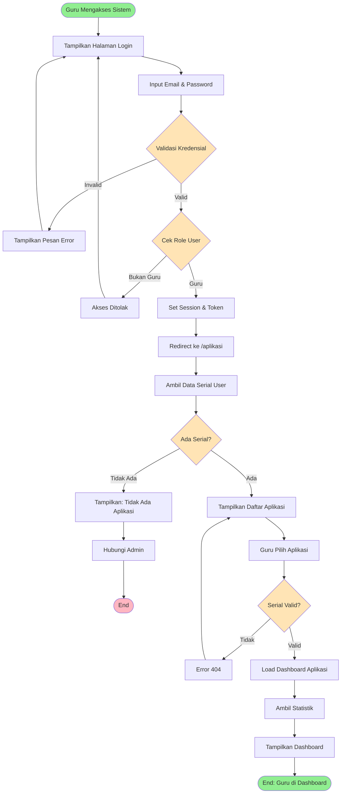

# BPMN: Login dan Pilih Aplikasi

## Deskripsi Proses
Proses autentikasi guru dan pemilihan aplikasi/kurikulum yang akan digunakan.

## Diagram BPMN

## Actor
- **Guru** (Primary Actor)
- **Sistem Authentication** (Laravel Breeze)

## Preconditions
- Guru sudah terdaftar di sistem
- Guru memiliki minimal 1 serial produk aktif

## Postconditions
- Guru berhasil login
- Session aktif
- Guru berada di dashboard aplikasi yang dipilih

## Main Flow
1. Guru mengakses halaman login
2. Sistem menampilkan form login
3. Guru memasukkan email dan password
4. Sistem memvalidasi kredensial
5. Sistem mengecek role user (harus guru)
6. Sistem membuat session dan redirect ke `/aplikasi`
7. Sistem mengambil daftar serial milik guru
8. Sistem menampilkan daftar aplikasi
9. Guru memilih salah satu aplikasi
10. Sistem memvalidasi serial yang dipilih
11. Sistem load dashboard dengan statistik
12. Sistem menampilkan dashboard aplikasi

## Alternative Flow
### A1: Kredensial Invalid
- 4a. Jika kredensial salah, tampilkan error dan kembali ke login

### A2: Bukan Role Guru
- 5a. Jika user bukan guru, akses ditolak

### A3: Tidak Ada Serial
- 7a. Jika guru tidak memiliki serial, tampilkan pesan dan sarankan hubungi admin

### A4: Serial Invalid
- 10a. Jika serial tidak valid atau bukan milik guru, tampilkan error 404

## Business Rules
- BR-001: Hanya user dengan role "guru" yang bisa akses
- BR-002: Guru hanya bisa akses serial yang terdaftar atas namanya
- BR-003: Session berlaku selama 2 jam (configurable)
- BR-004: Password harus di-hash menggunakan Bcrypt

## Technical Notes
- **Controller**: `AplikasiController@index`, `AplikasiController@dashboard`
- **Middleware**: `auth`, `verified`
- **Routes**: `/aplikasi`, `/aplikasi/{serial}`
- **Models**: Serial, Product, User
- **View**: `guru.aplikasi.index`, `guru.aplikasi.dashboard`
