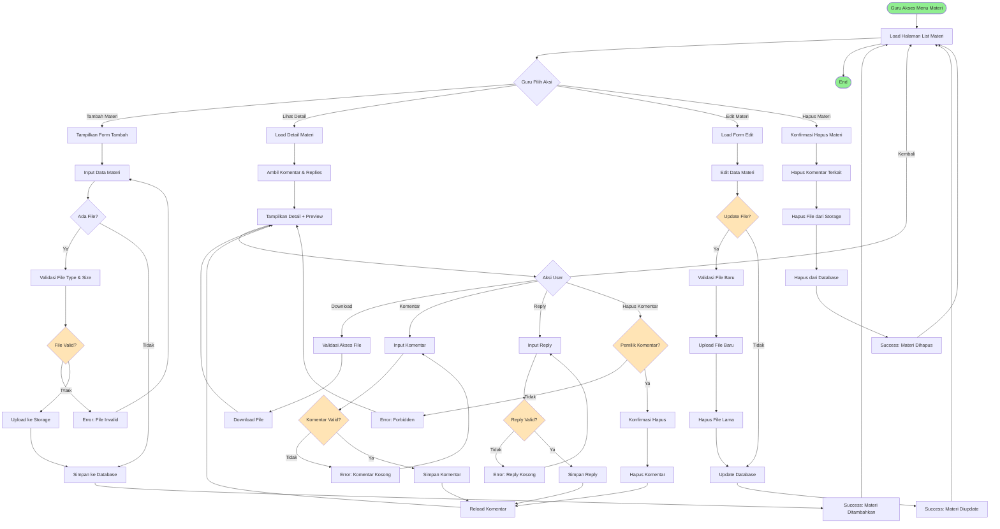

# BPMN: Manajemen Materi Pembelajaran

## Deskripsi Proses
Proses lengkap pengelolaan materi pembelajaran oleh guru, termasuk create, read, update, delete (CRUD), dan fitur diskusi.

## Diagram BPMN

## Actor
- **Guru** (Primary Actor)
- **Siswa** (Secondary Actor - untuk diskusi)

## Preconditions
- Guru sudah login
- Guru berada di dalam aplikasi/serial tertentu
- Guru memiliki akses ke kelas dan mata pelajaran

## Postconditions
- Materi berhasil dikelola (tambah/edit/hapus)
- File tersimpan di storage
- Data tersimpan di database
- Diskusi terekam dengan baik

## Main Flow: Tambah Materi
1. Guru klik "Tambah Materi"
2. Sistem tampilkan form input
3. Guru input judul, konten, pilih kelas, mapel, tema
4. Guru upload file (opsional)
5. Sistem validasi file (type, size max 10MB)
6. Sistem upload file ke storage
7. Sistem simpan data ke tabel `posts` (is_task = 0)
8. Sistem redirect dengan pesan sukses

## Main Flow: Lihat Detail & Diskusi
1. Guru klik "Lihat Detail" pada materi
2. Sistem load detail materi dengan eager loading comments
3. Sistem tampilkan preview file (PDF/Image/Video)
4. Sistem tampilkan form komentar
5. Guru/Siswa input komentar
6. Sistem simpan ke tabel `post_comments`
7. Sistem reload dan tampilkan komentar baru
8. User bisa reply komentar (nested)
9. Sistem simpan reply ke `post_child_comments`

## Alternative Flow
### A1: File Invalid
- 5a. Jika file > 10MB atau type tidak didukung, tampilkan error

### A2: Komentar Kosong
- 5b. Jika komentar kosong, tampilkan error validasi

### A3: Hapus Komentar Bukan Pemilik
- User coba hapus komentar orang lain, sistem tolak dengan 403

### A4: Edit Materi
- Guru bisa edit materi yang sudah ada
- File lama dihapus jika ada upload baru

### A5: Hapus Materi
- Sistem hapus cascade: komentar, replies, file storage, record DB

## Business Rules
- BR-001: File maksimal 10MB
- BR-002: Format file: PDF, DOC, DOCX, PPT, PPTX, MP4, JPG, PNG
- BR-003: Hanya pemilik komentar yang bisa hapus
- BR-004: Materi hanya bisa diedit/hapus oleh pembuat
- BR-005: Komentar ditampilkan dari yang terbaru
- BR-006: Reply maksimal 1 level (tidak bisa reply ke reply)

## Technical Notes
- **Controller**: `MateriController`
- **Methods**: `index`, `store`, `showDetail`, `storeComment`, `storeReply`, `deleteComment`, `deleteReply`
- **Models**: Post, PostComment, PostChildComment, Classroom, Mapel, Theme
- **Storage**: `storage/app/public/materials`
- **Validation**: File mimes, max size, required fields
- **Security**: CSRF token, ownership validation, file type checking
