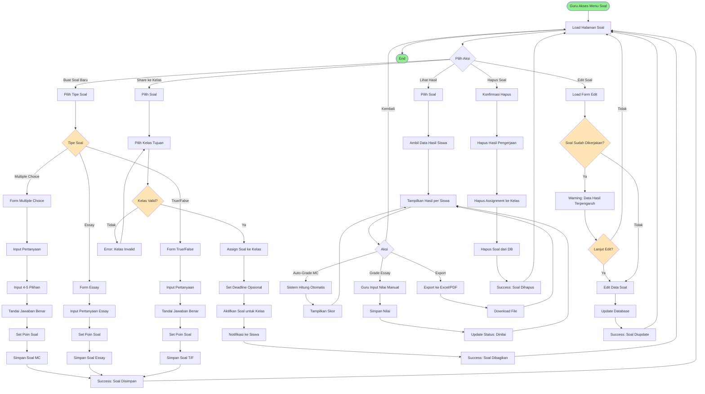

# BPMN: Manajemen Soal Latihan

## Deskripsi Proses
Proses pembuatan, pengelolaan, dan distribusi soal latihan dengan berbagai tipe (Multiple Choice, Essay, True/False) serta sistem auto-grading.

## Diagram BPMN

## Actor
- **Guru** (Primary Actor)
- **Siswa** (Secondary Actor - mengerjakan soal)
- **Sistem Auto-Grading** (Supporting System)

## Preconditions
- Guru sudah login dan berada di aplikasi/serial
- Guru memiliki akses ke kelas
- Kompetensi dan materi sudah terdefinisi

## Postconditions
- Soal berhasil dibuat dan tersimpan
- Soal terdistribusi ke kelas yang dituju
- Hasil pengerjaan siswa terekam
- Auto-grading berfungsi untuk MC dan T/F

## Main Flow: Buat Soal Multiple Choice
1. Guru klik "Buat Soal Baru"
2. Guru pilih tipe "Multiple Choice"
3. Sistem tampilkan form MC
4. Guru input pertanyaan
5. Guru input 4-5 pilihan jawaban (A, B, C, D, E)
6. Guru tandai 1 jawaban sebagai benar
7. Guru set poin soal (misal: 10 poin)
8. Guru pilih kompetensi terkait
9. Sistem validasi input
10. Sistem simpan ke tabel `exercises` dan `exercise_items`
11. Sistem redirect dengan pesan sukses

## Main Flow: Share Soal ke Kelas
1. Guru pilih soal dari daftar
2. Guru klik "Share ke Kelas"
3. Sistem tampilkan daftar kelas guru
4. Guru pilih 1 atau lebih kelas
5. Guru set deadline (opsional)
6. Guru set timer/durasi pengerjaan (opsional)
7. Sistem assign soal ke kelas via pivot table
8. Sistem buat notifikasi untuk siswa di kelas tersebut
9. Soal muncul di dashboard siswa

## Main Flow: Auto-Grading Multiple Choice
1. Siswa submit jawaban MC
2. Sistem ambil jawaban siswa
3. Sistem bandingkan dengan jawaban benar di database
4. Sistem hitung: (Jumlah Benar / Total Soal) × 100
5. Sistem simpan nilai otomatis
6. Sistem update status: "Selesai - Dinilai"
7. Siswa bisa lihat nilai langsung

## Main Flow: Manual Grading Essay
1. Guru lihat hasil pengerjaan essay
2. Sistem tampilkan jawaban essay siswa
3. Guru baca dan nilai jawaban
4. Guru input nilai (0-100 atau sesuai poin max)
5. Guru bisa tambahkan feedback
6. Sistem simpan nilai
7. Status berubah menjadi "Dinilai"
8. Siswa mendapat notifikasi nilai

## Alternative Flow
### A1: Soal Sudah Dikerjakan Siswa
- Jika guru edit soal yang sudah dikerjakan, sistem beri warning
- Data hasil pengerjaan siswa bisa terpengaruh

### A2: Randomize Soal
- Sistem bisa acak urutan soal untuk tiap siswa
- Sistem acak urutan pilihan jawaban MC

### A3: Bank Soal Admin
- Guru bisa akses soal dari admin/pusat
- Guru tinggal assign ke kelas tanpa buat dari nol

## Business Rules
- BR-001: MC harus punya minimal 2 pilihan, maksimal 5 pilihan
- BR-002: Hanya 1 jawaban benar untuk MC dan T/F
- BR-003: Essay tidak ada auto-grading, harus manual
- BR-004: Poin soal minimal 1, maksimal 100
- BR-005: Deadline opsional, tapi recommended
- BR-006: Timer bisa diset untuk ujian (misal: 90 menit)
- BR-007: Siswa hanya bisa kerjakan 1x (no retry default)

## Technical Notes
- **Controller**: `SoalController`
- **Models**: Exercise, ExerciseItem, ExerciseType, Competence, ExercisePoint
- **Auto-Grading Logic**: Controller method `autoGrade()`
- **Pivot Table**: `classroom_exercise` untuk assignment
- **Randomizer**: `->inRandomOrder()` untuk acak soal
- **Timer**: JavaScript countdown di frontend
- **Export**: Laravel Excel package
