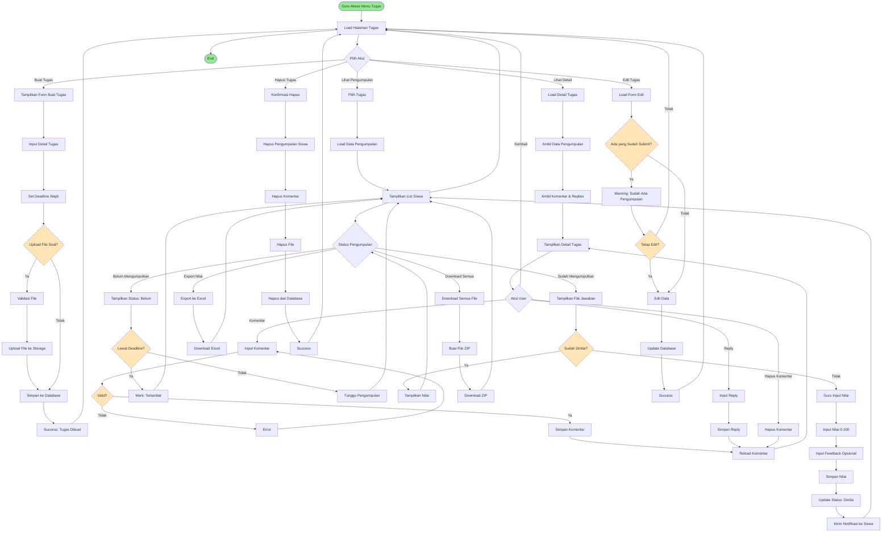

# BPMN: Manajemen Tugas (Assignment)

## Deskripsi Proses
Proses pembuatan tugas, distribusi ke siswa, pengumpulan jawaban, penilaian, dan fitur diskusi pada tugas.

## Diagram BPMN

## Actor
- **Guru** (Primary Actor)
- **Siswa** (Secondary Actor - mengumpulkan tugas)

## Preconditions
- Guru sudah login dan berada di aplikasi/serial
- Guru memiliki akses ke kelas
- Materi pembelajaran sudah ada (opsional)

## Postconditions
- Tugas berhasil dibuat dengan deadline
- Siswa bisa lihat dan kerjakan tugas
- Pengumpulan terekam dengan timestamp
- Penilaian tersimpan dan siswa mendapat feedback

## Main Flow: Buat Tugas
1. Guru klik "Buat Tugas"
2. Sistem tampilkan form input
3. Guru input:
   - Judul tugas
   - Deskripsi/instruksi
   - Pilih kelas
   - Pilih mata pelajaran
   - Pilih tema/subtema (opsional)
   - **Set deadline (wajib)**
4. Guru upload file soal/instruksi (PDF, DOC, etc) - opsional
5. Sistem validasi input dan file
6. Sistem upload file ke storage
7. Sistem simpan ke tabel `posts` dengan `is_task = 1`
8. Sistem redirect dengan pesan sukses
9. Tugas muncul di dashboard siswa

## Main Flow: Siswa Mengumpulkan Tugas
1. Siswa lihat tugas di dashboard
2. Siswa klik "Kerjakan Tugas"
3. Sistem tampilkan detail tugas dan deadline
4. Siswa download file soal (jika ada)
5. Siswa kerjakan tugas offline
6. Siswa upload file jawaban
7. Sistem validasi file (type, size)
8. Sistem simpan ke tabel `tasks` dengan timestamp
9. Status berubah: "Sudah Dikumpulkan"
10. Guru mendapat notifikasi ada pengumpulan baru

## Main Flow: Guru Menilai Tugas
1. Guru klik "Lihat Pengumpulan"
2. Sistem tampilkan list siswa dengan status
3. Guru klik siswa yang sudah mengumpulkan
4. Sistem tampilkan file jawaban siswa
5. Guru download dan review jawaban
6. Guru input nilai (0-100)
7. Guru input feedback/komentar (opsional)
8. Sistem simpan nilai ke kolom `point`
9. Status berubah: "Sudah Dinilai"
10. Siswa mendapat notifikasi nilai keluar

## Main Flow: Diskusi pada Tugas
1. Guru/Siswa buka detail tugas
2. Sistem tampilkan section diskusi di bawah detail
3. User input komentar/pertanyaan
4. Sistem simpan ke `post_comments`
5. User lain bisa reply (nested comment)
6. Sistem simpan reply ke `post_child_comments`
7. Notifikasi ke pemilik comment yang di-reply

## Alternative Flow
### A1: Pengumpulan Terlambat
- Jika siswa submit setelah deadline, sistem tandai "Terlambat"
- Guru bisa lihat berapa lama keterlambatan
- Guru tetap bisa nilai, tapi ada indikator terlambat

### A2: Siswa Belum Mengumpulkan
- Status: "Belum Dikumpulkan"
- Jika lewat deadline: "Tidak Mengumpulkan"
- Nilai otomatis 0 atau kosong

### A3: Edit Tugas Setelah Ada Pengumpulan
- Sistem beri warning
- Jika guru tetap edit, pengumpulan siswa tetap valid
- Hindari ubah deadline mundur jika sudah ada yang submit

### A4: Download Semua Jawaban
- Guru klik "Download Semua"
- Sistem buat ZIP berisi semua file jawaban
- Nama file: NamaLengkapSiswa_Tugas.ext

### A5: Export Nilai
- Guru export rekap nilai ke Excel
- Berisi: Nama, NIS, Status, Nilai, Tanggal Submit, Keterlambatan

## Business Rules
- BR-001: Deadline wajib diisi saat buat tugas
- BR-002: Siswa hanya bisa submit 1 file (bisa re-upload sebelum deadline)
- BR-003: File jawaban max 10MB
- BR-004: Nilai range: 0-100
- BR-005: Tugas yang belum dikumpulkan setelah deadline = 0
- BR-006: Guru bisa re-grade (ubah nilai)
- BR-007: Feedback muncul setelah dinilai
- BR-008: Hanya pemilik comment bisa hapus comment
- BR-009: Diskusi bisa diakses sebelum dan sesudah deadline

## Technical Notes
- **Controller**: `TugasController`
- **Models**: Post (is_task=1), Task, PostComment, PostChildComment
- **Storage**: `storage/app/public/tasks` untuk soal, `storage/app/public/submissions` untuk jawaban
- **Pivot**: Tidak ada pivot, tugas langsung ke kelas via `classroom_id`
- **Status Tracking**: 
  - Belum Dikumpulkan (task record tidak ada)
  - Sudah Dikumpulkan (task.point = null)
  - Sudah Dinilai (task.point != null)
- **ZIP Creation**: ZipArchive PHP untuk download bulk
- **Export**: Laravel Excel package
