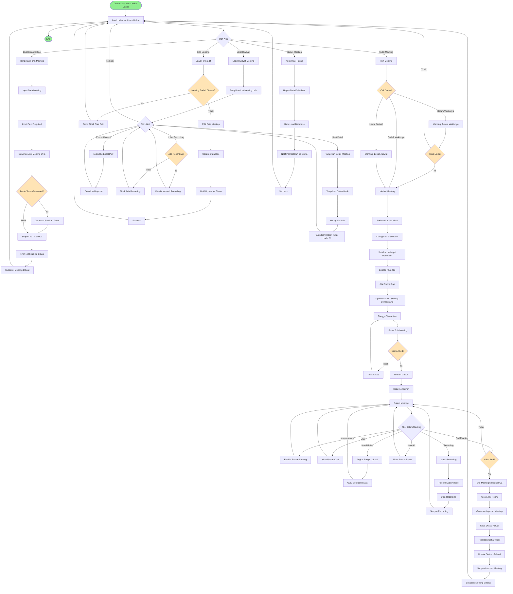

# BPMN: Kelas Online dengan Jitsi Meet

## Deskripsi Proses
Proses pembuatan, penjadwalan, dan pelaksanaan kelas online menggunakan integrasi Jitsi Meet untuk video conference.

## Diagram BPMN

## Actor
- **Guru** (Primary Actor - Moderator)
- **Siswa** (Secondary Actor - Participant)
- **Jitsi Meet Server** (External System)

## Preconditions
- Guru sudah login dan berada di aplikasi/serial
- Guru memiliki akses ke kelas
- Internet connection stabil
- Jitsi Meet API accessible

## Postconditions
- Meeting terjadwal atau selesai dilaksanakan
- Daftar kehadiran terekam
- Laporan meeting tersimpan
- Recording tersedia (jika direkam)

## Main Flow: Buat Kelas Online
1. Guru klik "Buat Kelas Online"
2. Sistem tampilkan form input
3. Guru input:
   - Judul meeting
   - Pilih kelas
   - Pilih mata pelajaran
   - Tanggal dan waktu mulai
   - Durasi (dalam menit)
   - Deskripsi/agenda (opsional)
4. Sistem generate unique Jitsi room URL
   - Format: `https://meet.jit.si/DashboardGuru-{randomString}`
5. Sistem simpan ke tabel `online_meetings`
6. Sistem kirim notifikasi ke siswa di kelas tersebut
7. Meeting muncul di dashboard siswa dan guru

## Main Flow: Mulai dan Jalankan Meeting
1. Guru klik "Mulai Meeting" sesuai jadwal
2. Sistem validasi waktu (bisa mulai lebih awal)
3. Sistem redirect ke Jitsi Meet dengan URL unik
4. Jitsi load dengan konfigurasi:
   - Guru otomatis sebagai moderator
   - Room name sesuai judul meeting
   - Display name: Nama guru
5. Guru menunggu siswa join
6. Siswa klik "Join Meeting" dari dashboard
7. Sistem validasi siswa terdaftar di kelas
8. Siswa join Jitsi room
9. Sistem catat kehadiran siswa (timestamp join)
10. Meeting berlangsung dengan fitur:
    - Video & Audio
    - Screen sharing
    - Chat
    - Hand raise
    - Recording (opsional)
    - Mute participants (guru)
11. Guru klik "End Meeting" saat selesai
12. Sistem tutup room untuk semua participant
13. Sistem generate laporan:
    - Durasi actual
    - Daftar hadir (siapa join, kapan join, berapa lama)
    - Total peserta
14. Sistem update status meeting: "Selesai"

## Alternative Flow
### A1: Mulai Meeting Lebih Awal
- Guru bisa start meeting sebelum jadwal
- Sistem beri warning, tapi tetap izinkan

### A2: Siswa Join Terlambat
- Siswa tetap bisa join meskipun meeting sudah dimulai
- Sistem catat waktu join actual (terlambat)

### A3: Siswa Tidak Join
- Status kehadiran: "Tidak Hadir"
- Otomatis tercatat di laporan

### A4: Recording Meeting
- Guru klik "Start Recording" di Jitsi
- Video terekam di server Jitsi
- Link recording disimpan di database
- Siswa bisa akses recording di-kemudian hari

### A5: Meeting Gagal/Koneksi Terputus
- Jika guru disconnect, siswa tetap di room
- Guru bisa rejoin sebagai moderator
- Jitsi auto-reconnect jika internet pulih

### A6: Edit Meeting
- Hanya bisa edit meeting yang belum dimulai
- Bisa ubah jadwal, durasi, deskripsi
- Tidak bisa ubah kelas (harus buat baru)

### A7: Hapus/Cancel Meeting
- Bisa cancel meeting sebelum dimulai
- Sistem hapus data dan kirim notifikasi pembatalan
- Tidak bisa hapus meeting yang sudah selesai (hanya arsip)

## Business Rules
- BR-001: URL Jitsi unique per meeting (no reuse)
- BR-002: Guru otomatis moderator dengan full control
- BR-003: Siswa hanya participant (no moderator rights)
- BR-004: Meeting bisa dimulai max 30 menit sebelum jadwal
- BR-005: Kehadiran dicatat saat siswa join Jitsi room
- BR-006: Durasi actual bisa beda dengan durasi planned
- BR-007: Recording opsional, perlu consent
- BR-008: Chat history tidak disimpan (Jitsi behavior)
- BR-009: Meeting auto-close jika moderator end
- BR-010: Siswa tidak bisa start meeting (hanya join)

## Technical Notes
- **Controller**: `KelasOnlineController`
- **Models**: OnlineMeeting, Classroom, Mapel
- **Jitsi Integration**: 
  - URL: `https://meet.jit.si/{roomName}`
  - Room name: unique string generate dengan `Str::random(20)`
  - Iframe embed atau redirect langsung
  - Moderator: Pass JWT token (opsional untuk security)
- **Attendance Tracking**: 
  - Table: `meeting_attendances`
  - Fields: meeting_id, student_id, joined_at, left_at
- **Recording**: 
  - Jitsi local recording atau Jibri integration
  - Storage: Jitsi server atau S3
  - Link simpan di `online_meetings.recording_url`
- **Notification**: 
  - Email (Laravel Mail)
  - In-app notification
  - Optional: WhatsApp via API
- **Export**: Laravel Excel untuk daftar hadir
