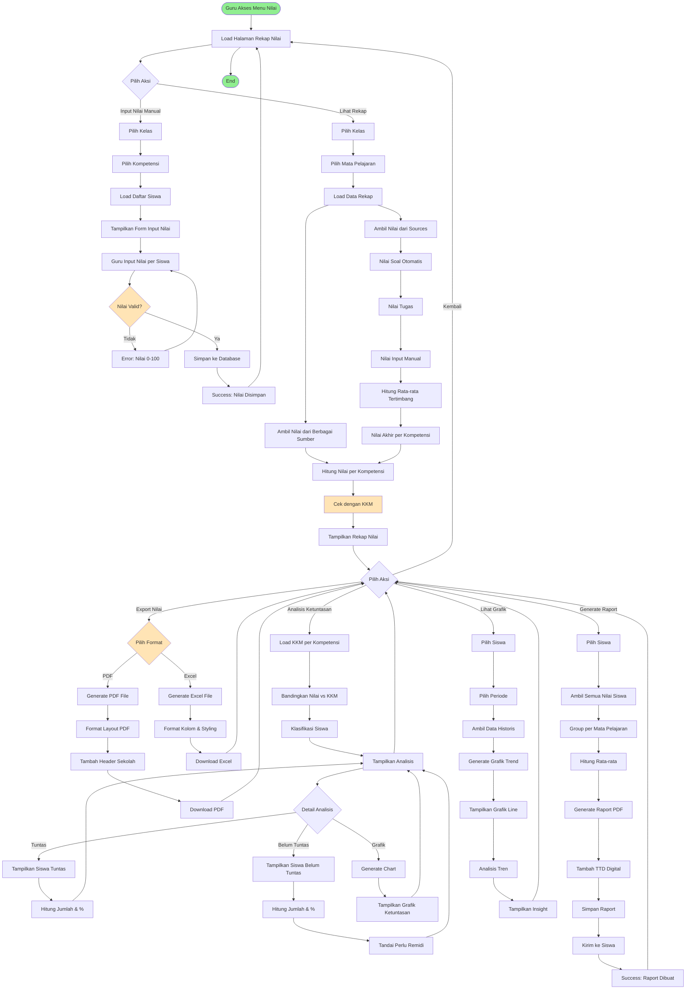

# BPMN: Sistem Penilaian dan Rekap Nilai

## Deskripsi Proses
Proses input nilai, perhitungan rekap nilai per kompetensi, analisis KKM, dan export laporan nilai siswa.

## Diagram BPMN



## Actor
- **Guru** (Primary Actor)
- **Siswa** (Secondary Actor - menerima raport)
- **Wali Kelas** (jika ada - approve raport)

## Preconditions
- Guru sudah login dan berada di aplikasi/serial
- Data siswa, kelas, dan mata pelajaran sudah ada
- Kompetensi dan KKM sudah didefinisikan
- Nilai dari soal dan tugas sudah tersimpan

## Postconditions
- Nilai terekap dengan akurat
- Ketuntasan siswa teridentifikasi
- Raport digital tersedia
- Export nilai siap untuk administrasi

## Main Flow: Lihat Rekap Nilai
1. Guru klik "Rekap Nilai"
2. Sistem tampilkan filter kelas dan mapel
3. Guru pilih kelas dan mata pelajaran
4. Sistem load data nilai dari berbagai sumber:
   - Nilai soal (exercises) - otomatis
   - Nilai tugas (tasks) - manual input guru
   - Nilai input manual (grades) - langsung input
5. Sistem hitung nilai per kompetensi:
   - Rata-rata tertimbang (jika ada bobot)
   - Atau rata-rata sederhana
6. Sistem bandingkan dengan KKM
7. Sistem tampilkan rekap dalam tabel:
   - Kolom: Nama Siswa, NIS, Kompetensi A, B, C, ..., Rata-rata
   - Warna: Hijau (tuntas), Merah (belum tuntas)
8. Guru bisa lihat detail per siswa

## Main Flow: Input Nilai Manual
1. Guru klik "Input Nilai Manual"
2. Sistem tampilkan filter kelas
3. Guru pilih kelas
4. Guru pilih kompetensi yang akan dinilai
5. Sistem tampilkan daftar siswa di kelas tersebut
6. Guru input nilai per siswa (0-100)
7. Guru bisa input catatan/keterangan (opsional)
8. Sistem validasi nilai (0-100)
9. Sistem simpan ke tabel `grades`
10. Success message dan kembali ke rekap

## Main Flow: Analisis Ketuntasan
1. Dari halaman rekap, guru klik "Analisis Ketuntasan"
2. Sistem load KKM untuk mata pelajaran dan kompetensi
3. Sistem klasifikasi siswa:
   - **Tuntas**: Nilai ≥ KKM
   - **Belum Tuntas**: Nilai < KKM
4. Sistem hitung statistik:
   - Jumlah siswa tuntas
   - Jumlah siswa belum tuntas
   - Persentase ketuntasan klasikal
5. Sistem generate grafik pie chart
6. Sistem tampilkan daftar siswa per kategori
7. Guru bisa tandai siswa belum tuntas untuk remidi
8. Sistem bisa auto-create remedial assignment

## Main Flow: Export Nilai ke Excel
1. Guru klik "Export" dari rekap nilai
2. Guru pilih format "Excel"
3. Sistem generate Excel file dengan:
   - Sheet 1: Rekap Nilai per Siswa
   - Sheet 2: Statistik Ketuntasan
   - Sheet 3: Grafik (embedded chart)
4. Formatting:
   - Header bold, freeze pane
   - Warna conditional (hijau/merah)
   - Border dan alignment
5. Sistem generate file `.xlsx`
6. Sistem trigger download
7. File tersimpan di komputer guru

## Main Flow: Generate Raport Digital
1. Guru klik "Generate Raport"
2. Guru pilih siswa (atau batch untuk semua siswa)
3. Sistem ambil semua nilai siswa untuk semua mapel
4. Sistem group per mata pelajaran
5. Sistem hitung rata-rata per mapel
6. Sistem hitung rata-rata keseluruhan
7. Sistem load template raport (PDF)
8. Sistem isi data:
   - Identitas siswa
   - Nilai per mata pelajaran
   - Ketuntasan
   - Catatan guru
   - TTD digital guru/kepala sekolah
9. Sistem generate PDF raport
10. Sistem simpan ke storage
11. Sistem kirim notifikasi ke siswa dan orang tua
12. Raport bisa didownload dari dashboard siswa

## Alternative Flow
### A1: Nilai Belum Lengkap
- Jika ada siswa belum punya nilai di kompetensi tertentu
- Sistem tampilkan "-" atau "Belum Ada Nilai"
- Rata-rata dihitung dari nilai yang ada saja

### A2: Edit Nilai yang Sudah Disimpan
- Guru bisa re-input nilai
- Sistem update database
- Rekap otomatis ter-update

### A3: KKM Belum Diset
- Jika KKM belum didefinisikan
- Sistem gunakan default 75 atau tampilkan warning
- Guru harus set KKM terlebih dahulu

### A4: Export PDF dengan Logo Sekolah
- Template PDF include logo sekolah
- Header dan footer custom per sekolah
- TTD digital atau placeholder TTD

### A5: Grafik Perkembangan Siswa
- Guru pilih siswa tertentu
- Sistem tampilkan grafik line chart
- Sumbu X: Periode (bulan/semester)
- Sumbu Y: Nilai rata-rata
- Bisa filter per mata pelajaran

## Business Rules
- BR-001: Nilai range 0-100
- BR-002: KKM default 75 (configurable per mapel/kompetensi)
- BR-003: Nilai akhir = rata-rata semua penilaian per kompetensi
- BR-004: Ketuntasan klasikal minimal 75% siswa tuntas
- BR-005: Nilai yang belum ada tidak mengurangi rata-rata (ignored)
- BR-006: Raport hanya bisa di-generate saat akhir semester
- BR-007: Export hanya untuk kelas yang guru ampu
- BR-008: Bobot nilai bisa diatur: Tugas 30%, Soal 40%, UTS 30% (configurable)

## Technical Notes
- **Controller**: `RekapNilaiController`
- **Models**: Grade, ExercisePoint, Task, Competence, Classroom, Student
- **Calculation**: 
  ```php
  $nilaiAkhir = ($nilaiTugas * 0.3) + ($nilaiSoal * 0.4) + ($nilaiUTS * 0.3);
  $status = $nilaiAkhir >= $kkm ? 'Tuntas' : 'Belum Tuntas';
  ```
- **Export Excel**: Laravel Excel (Maatwebsite/Excel)
- **Export PDF**: DomPDF atau TCPDF
- **Chart**: Chart.js di frontend, atau PHP Chart library
- **KKM Table**: `competences.kkm` atau separate `kkm` table
- **Raport Template**: Blade to PDF dengan styling
- **Notification**: Email/WhatsApp saat raport ready
