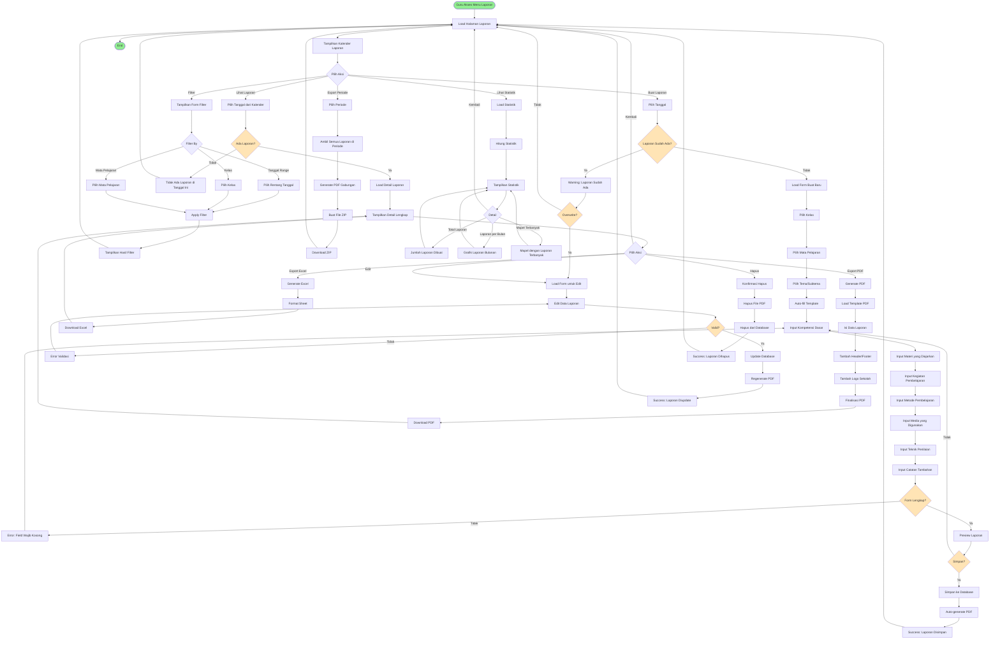

# BPMN: Laporan Pembelajaran Harian

## Deskripsi Proses
Proses pembuatan, penyimpanan, dan pengelolaan laporan pembelajaran harian guru sesuai standar administrasi sekolah.

## Diagram BPMN



## Actor
- **Guru** (Primary Actor)
- **Kepala Sekolah** (Secondary Actor - supervisi)
- **Admin** (untuk arsip)

## Preconditions
- Guru sudah login dan berada di aplikasi/serial
- Guru mengajar di kelas tertentu
- Data kelas, mapel, tema sudah tersedia
- Template laporan sudah didefinisikan

## Postconditions
- Laporan pembelajaran harian tersimpan
- PDF laporan ter-generate otomatis
- Laporan bisa diakses kapan saja untuk supervisi
- Arsip lengkap untuk administrasi

## Main Flow: Buat Laporan Harian
1. Guru klik "Buat Laporan"
2. Guru pilih tanggal pembelajaran
3. Sistem cek apakah sudah ada laporan di tanggal tersebut
4. Jika belum ada, sistem tampilkan form kosong
5. Guru input/pilih:
   - **Kelas**: Dari dropdown kelas yang diampu
   - **Mata Pelajaran**: Sesuai jadwal
   - **Tema/Subtema**: Sesuai kurikulum
6. Sistem auto-fill template dengan data yang dipilih
7. Guru melengkapi:
   - **Kompetensi Dasar (KD)**: Copy dari kurikulum atau manual
   - **Materi Pokok**: Ringkasan materi yang diajarkan
   - **Kegiatan Pembelajaran**:
     - Pendahuluan (apersepsi, motivasi)
     - Inti (eksplorasi, elaborasi, konfirmasi)
     - Penutup (kesimpulan, refleksi)
   - **Metode**: Ceramah, diskusi, praktik, dll
   - **Media**: Buku, PPT, video, dll
   - **Sumber Belajar**: Referensi
   - **Penilaian**: Teknik penilaian yang digunakan
   - **Catatan**: Hambatan, solusi, atau hal penting
8. Guru review preview laporan
9. Guru klik "Simpan"
10. Sistem validasi semua field wajib terisi
11. Sistem simpan ke tabel `reports`
12. Sistem auto-generate PDF dari data
13. PDF tersimpan di storage
14. Success message dan kembali ke kalender

## Main Flow: Lihat dan Export Laporan
1. Guru klik tanggal di kalender yang ada laporan (ditandai warna)
2. Sistem load detail laporan
3. Sistem tampilkan semua informasi lengkap
4. Guru bisa:
   - **Download PDF**: Klik "Export PDF"
   - **Download Excel**: Klik "Export Excel" (untuk rekap)
   - **Edit**: Ubah data laporan
   - **Hapus**: Hapus laporan (dengan konfirmasi)
5. Untuk PDF:
   - Sistem load template PDF (dengan logo sekolah)
   - Sistem isi data laporan ke template
   - Sistem generate PDF
   - User download file
6. Untuk Excel:
   - Sistem generate Excel dengan format tabel
   - User download file

## Main Flow: Export Laporan Periode
1. Guru klik "Export Periode"
2. Guru pilih rentang tanggal (misal: 1 bulan)
3. Guru pilih kelas (opsional)
4. Sistem fetch semua laporan di periode tersebut
5. Sistem buat 2 opsi:
   - **PDF Gabungan**: 1 PDF berisi semua laporan
   - **ZIP File**: Folder berisi PDF per tanggal
6. Guru pilih opsi
7. Sistem generate file
8. User download

## Main Flow: Statistik Laporan
1. Guru klik "Statistik"
2. Sistem hitung:
   - Total laporan yang sudah dibuat
   - Total laporan bulan ini
   - Rata-rata laporan per minggu
   - Mata pelajaran dengan laporan terbanyak
   - Tanggal terakhir buat laporan
3. Sistem tampilkan grafik:
   - Bar chart: Laporan per bulan (6 bulan terakhir)
   - Pie chart: Distribusi per mata pelajaran
4. Sistem highlight:
   - Tanggal yang belum ada laporan (reminder)

## Alternative Flow
### A1: Overwrite Laporan Existing
- Jika guru pilih tanggal yang sudah ada laporan
- Sistem tampilkan warning
- Guru konfirmasi untuk edit/overwrite
- Data lama tetap tersimpan di log/history

### A2: Auto-Save Draft
- Form bisa di-save sebagai draft
- Guru bisa lanjutkan nanti
- Draft tidak generate PDF

### A3: Copy Laporan Sebelumnya
- Guru bisa copy laporan tanggal lain sebagai template
- Tinggal ubah bagian yang berbeda
- Efisien untuk materi yang berkelanjutan

### A4: Laporan Tidak Lengkap
- Jika field wajib kosong, tidak bisa simpan
- Sistem highlight field yang error
- Guru harus lengkapi dulu

### A5: Template Custom per Sekolah
- Admin bisa set template custom
- Logo, header, format bisa disesuaikan
- Guru tinggal pakai template yang sudah ada

## Business Rules
- BR-001: Satu tanggal bisa punya beberapa laporan (untuk kelas/mapel berbeda)
- BR-002: Field wajib: Tanggal, Kelas, Mapel, Materi, Kegiatan
- BR-003: Laporan bisa dibuat/edit kapan saja (tidak harus di hari H)
- BR-004: PDF auto-generate saat simpan laporan
- BR-005: Laporan yang dihapus bisa di-recover dalam 30 hari (soft delete)
- BR-006: Export periode maksimal 1 tahun
- BR-007: Template laporan mengikuti standar kurikulum (K13/Merdeka)

## Technical Notes
- **Controller**: `LaporanHarianController`
- **Models**: Report, Classroom, Mapel, Theme, Subtheme, Lesson
- **PDF Generation**: DomPDF atau TCPDF
  ```php
  use Barryvdh\DomPDF\Facade\Pdf;
  $pdf = Pdf::loadView('laporan.pdf', compact('report'));
  return $pdf->download('laporan-'.$report->date.'.pdf');
  ```
- **Excel Export**: Laravel Excel
- **Template**: Blade template untuk PDF dengan styling
- **Storage**: `storage/app/public/reports/pdf/`
- **Calendar UI**: FullCalendar.js atau simple calendar component
- **Auto-fill**: Data tema/subtema dari tabel `lessons`
- **Filter**: Query builder dengan where clauses
- **Statistik**: Aggregate queries (count, groupBy)
