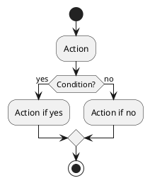

# PlantUML Diagrams - DashboardGuru

Folder ini berisi diagram alur sistem DashboardGuru dalam format PlantUML.

## Daftar Diagram

1. **[01-sistem-utama.puml](01-sistem-utama.puml)** - Flowchart Sistem Utama
2. **[02-login-autentikasi.puml](02-login-autentikasi.puml)** - Alur Login dan Autentikasi
3. **[03-manajemen-kelas.puml](03-manajemen-kelas.puml)** - Alur Manajemen Kelas
4. **[04-materi-pembelajaran.puml](04-materi-pembelajaran.puml)** - Alur Materi Pembelajaran
5. **[05-soal-latihan.puml](05-soal-latihan.puml)** - Alur Soal dan Latihan
6. **[06-tugas-penilaian.puml](06-tugas-penilaian.puml)** - Alur Tugas dan Penilaian
7. **[07-laporan-harian.puml](07-laporan-harian.puml)** - Alur Laporan Harian
8. **[08-rekap-nilai.puml](08-rekap-nilai.puml)** - Alur Rekap Nilai
9. **[09-kelas-online.puml](09-kelas-online.puml)** - Alur Kelas Online (Jitsi Meet)

## Cara Menggunakan

### Online (Recommended)

Gunakan PlantUML Online Editor:

1. Buka http://www.plantuml.com/plantuml/uml/
2. Copy isi file .puml
3. Paste di editor
4. Diagram akan otomatis di-render

### VS Code Extension

1. Install extension: **PlantUML** by jebbs

   ```
   ext install jebbs.plantuml
   ```

2. Install GraphViz:

   - **Windows**: Download dari https://graphviz.org/download/
   - **Ubuntu/Debian**: `sudo apt-get install graphviz`
   - **macOS**: `brew install graphviz`

3. Cara melihat diagram:
   - Buka file .puml
   - Tekan `Alt + D` atau klik kanan → "Preview Current Diagram"

### Generate PNG/SVG

Dari VS Code dengan PlantUML extension:

- Klik kanan pada file .puml
- Pilih "Export Current Diagram"
- Pilih format: PNG, SVG, PDF, dll.

### Command Line (Java)

```bash
# Install PlantUML
java -jar plantuml.jar

# Generate PNG
java -jar plantuml.jar diagram.puml

# Generate SVG
java -jar plantuml.jar -tsvg diagram.puml
```

## Syntax PlantUML

### Activity Diagram



### Common Elements

- `start` / `stop` - Mulai/akhir diagram
- `:Action;` - Activity/action
- `if (condition?) then (yes) else (no) endif` - Decision
- `switch (value?) case (option1) case (option2) endswitch` - Switch case
- `repeat :action; repeat while (condition?) is (yes)` - Loop
- `partition "Name" { }` - Grouping

## Export untuk Dokumentasi

Setelah generate gambar, simpan di folder `docs/images/diagrams/` untuk digunakan dalam dokumentasi.

## Reference

- PlantUML Official: https://plantuml.com/
- Activity Diagram Guide: https://plantuml.com/activity-diagram-beta
- Online Editor: http://www.plantuml.com/plantuml/uml/

---

**Catatan:** Semua diagram ini merupakan bagian dari dokumentasi sistem DashboardGuru dan harus diupdate seiring dengan perubahan sistem.
